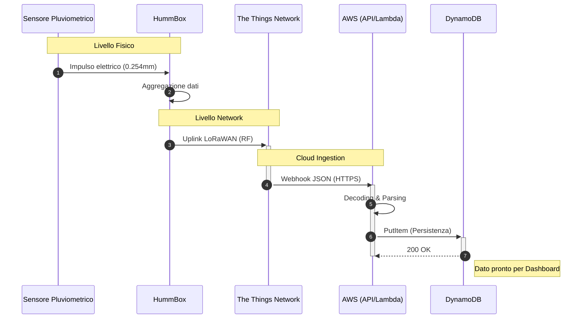

# pluviometro-lora
> Architettura di un sistema di monitoraggio pluviometrico IoT su protocollo LoRaWan e Architettura Serverless AWS

1) Introduzione
2) Architettura del sistema
3) Sfide tecniche
4) Risultati?

## Introduzione
Il sistema descrive l'implementazione di una pipeline dati completa, dal rilevamento fisico delle precipitazioni alla persistenza dei dati elaborati
| Componente | Tecnologia/Modello | Ruolo |
| :--- | :--- | :--- |
| **Sensore** | Davis Instruments | Rilevazione millimetrica delle precipitazioni |
| **Nodo LoRa** | HummBox GreenCityZen | Trasmissione dati a lungo raggio |
| **Network Server** | The Things Network (TTN) | Decodifica dei pacchetti e instradamento |
| **Cloud Gateway** | AWS API Gateway | Endpoint per integrazione del WebHook |
| **Calcolo** | AWS Lambda | Elaborazione dei dati |
| **Database** | AWS DynamoDB | Archiviazione NoSQL scalabile |

## Specifiche tecniche dei componenti
### Sensore Pluviometrico

### HummBox

## Flusso dei dati

## Architettura del sistema
### Livello Fisico
Il sensore pluviometrico viene connesso attraverso un connettore M12 alla HummBox.
La HummBox presenta un'antenna, usata per trasmettere il dato al primo Gateway disponibile.
Questa infrastruttura si appoggia a Gateway pubblici, il protocollo LoRa, infatti, permette ad un qualunque Gateway di trasmettere in rete i segnali ricevuti da diversi End Device, anche se non appartenenti alla stessa applicazione.

### The Things Network (TTN)
The Things Network è il portale che si occupa di ricevere, interpretare ed inoltrare i pacchetti.
Dopo essersi registrati è stata creata l'applicazione "Sensore Pluviometrico" ed è stato registrato l'end device.

Per la registrazione dell'end device è necessario impostare i seguenti parametri:

| Parametro | Struttura | Significato |
| :--- | :--- | :--- |
| **App EUI** | 8 byte esadecimali | Identifica in modo univoco l'applicazione |
| **Dev EUI** | 8 byte esadecimali | Identifica in modo univoco l'end device |
| **App Key** | 16 byte esadecimali | Chiave di sicurezza per crittografare i dati durante la trasmissione |

Così facendo ogni pacchetto inviato dalla HummBox verrà visualizzato sul portale TTN sotto forma di file JSON.

Il payload del pacchetto dati che riceveremo è composto da 5 byte:

| Byte 0 | Byte 1 | Byte 2 | Byte 3 | Byte 4 |
| :--- | :--- | :--- | :--- | :--- |
| Tipo di pacchetto | Contatore (LSB) | Contatore (MSB) | Temperatura? | Batteria |

Nella sezione Payload Formatter di TTN è possibile scrivere il codice per interpretare il pacchetto appena viene ricevuto, il risultato di questa lettura viene collocato in un file JSON.

### AWS API Gateway
È un servizio PaaS (Platform as a Service) che consente la creazione, protezione e gestione di interfacce di programmazione verso endpoint backend diversificati.
Per questa appicazione è stato scelto il paradigma HTTP APIs, il flusso dei dati è il seguente:
| Fase | Descrizione |
| :--- | :--- |
| Preparazione dati | TTN genera un payload JSON dopo aver decodificato il payload |
| Invocazione WebHook | TTN esegue una richiesta `POST` verso l'URL pubblico esposto da AWS API Gateway |
| Validazione Dati | Ricevuta la richiesta HTTPS, API Gateway controlla la validità dei certificati SSL/TLS |
| BackEnd | Il dato viene elaborato dal servizio BackEnd |
| Acknowledge | API Gateway restituisce a TTN il codice di validazione `200`, confermando la ricezione | 

### AWS Lambda
È un servizio di calcolo Serverless, permette di eseguire del codice in seguito ad una chiamata, senza la necessità di dover gestire l'infrastruttura fisica di un server.
Il linguaggio di programmazione scelto è Python 3.14

### DynamoDB
È un servizio di storage NoSQL di tipo `chiave-valore`, completamente gestito, interrogabile e facilmente scalabile.
