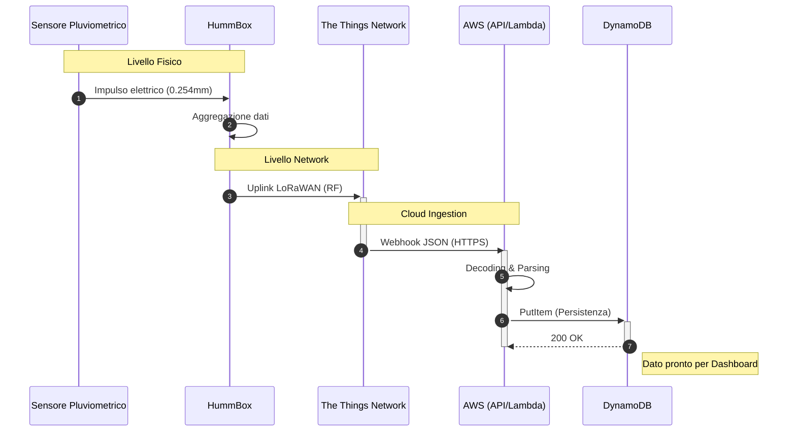

# pluviometro-lora
> Architettura di un sistema di monitoraggio pluviometrico IoT su protocollo LoRaWan e Architettura Serverless AWS

1) Introduzione
2) Architettura del sistema
3) Sfide tecniche
4) Risultati?

## Introduzione
Il sistema descrive l'implementazione di una pipeline dati completa, dal rilevamento fisico delle precipitazioni alla persistenza dei dati elaborati
| Componente | Tecnologia/Modello | Ruolo |
| :--- | :--- | :--- |
| **Sensore** | Davis Instruments | Rilevazione millimetrica delle precipitazioni |
| **Nodo LoRa** | HummBox GreenCityZen | Trasmissione dati a lungo raggio |
| **Network Server** | The Things Network (TTN) | Decodifica dei pacchetti e instradamento |
| **Cloud Gateway** | AWS API Gateway | Endpoint per integrazione del WebHook |
| **Calcolo** | AWS Lambda | Elaborazione dei dati |
| **Database** | AWS DynamoDB | Archiviazione NoSQL scalabile |

## Specifiche tecniche dei componenti

### Sensore Pluviometrico

### HummBox

### TTN

### AWS API Gateway

### AWS Lambda

### Database

## Flusso dei dati

