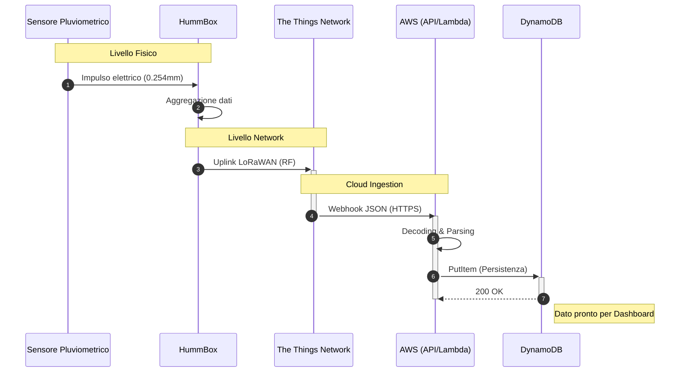

# Pluviometro-LoRa
> Architettura di un sistema di monitoraggio pluviometrico IoT su protocollo LoRaWan e Architettura Serverless AWS

1) Introduzione
2) Architettura del sistema
3) Sfide tecniche
4) Risultati?

## Introduzione
Il sistema descrive l'implementazione di una pipeline dati completa, dal rilevamento fisico delle precipitazioni alla persistenza dei dati elaborati

| Componente | Tecnologia/Modello | Ruolo |
| :--- | :--- | :--- |
| **Sensore** | Davis Instruments | Rilevazione millimetrica delle precipitazioni |
| **Nodo LoRa** | HummBox GreenCityZen | Trasmissione dati a lungo raggio |
| **Network Server** | The Things Network (TTN) | Decodifica dei pacchetti e instradamento |
| **Cloud Gateway** | AWS API Gateway | Endpoint per integrazione del WebHook |
| **Calcolo** | AWS Lambda | Elaborazione dei dati |
| **Database** | AWS DynamoDB | Archiviazione NoSQL scalabile |

## Specifiche tecniche dei componenti
### Sensore Pluviometrico

### HummBox

## Flusso dei dati

## Architettura del sistema
### Livello Fisico
Il sensore pluviometrico viene connesso attraverso un connettore M12 alla HummBox.

La HummBox presenta un'antenna, usata per trasmettere il dato al primo Gateway disponibile.

Questa infrastruttura si appoggia a Gateway pubblici, il protocollo LoRa, infatti, permette ad un qualunque Gateway di trasmettere in rete i segnali ricevuti da diversi End Device, anche se non appartenenti alla stessa applicazione.

### The Things Network (TTN)
The Things Network è il portale che si occupa di ricevere, interpretare ed inoltrare i pacchetti.

Dopo essersi registrati è stata creata l'applicazione "Sensore Pluviometrico" ed è stato registrato l'end device scegliendo un ID.

Per la registrazione dell'end device è necessario impostare i seguenti parametri per riconoscere l'end device:

| Parametro | Struttura | Significato |
| :--- | :--- | :--- |
| **App EUI** | 8 byte esadecimali | Identifica in modo univoco l'applicazione |
| **Dev EUI** | 8 byte esadecimali | Identifica in modo univoco l'end device |
| **App Key** | 16 byte esadecimali | Chiave di sicurezza per crittografare i dati durante la trasmissione |

Altre configurazioni relative all'End Device comprendono:
* Frequency Plan: `Europe 863-870 MHz (SF9 for RX2)`
* LoRaWAN Version: `LoRaWAN Specification 1.0.2`
* Regional Parameters Version: `RP001 Regional Parameters 1.0.2`

Così facendo ogni pacchetto inviato dalla HummBox verrà visualizzato sul portale TTN sotto forma di file JSON.

Il payload del pacchetto dati che riceveremo è composto da 5 byte:

| Byte 0 | Byte 1 | Byte 2 | Byte 3 | Byte 4 |
| :--- | :--- | :--- | :--- | :--- |
| Tipo di pacchetto | Contatore (LSB) | Contatore (MSB) | Temperatura? | Batteria (%) |

I pacchetti che contengono dati da salvare nel Database hanno il valore del Byte 0 pari a `0x10`

Nella sezione Payload Formatter di TTN è possibile scrivere il codice per interpretare il pacchetto appena viene ricevuto, il risultato di questa lettura viene collocato in un file JSON.

Il linguaggio scelto per la scrittura del Payload Formatter è il JavaScript

### AWS API Gateway
È un servizio PaaS (Platform as a Service) che consente la creazione, protezione e gestione di interfacce di programmazione verso endpoint backend diversificati.
Per questa appicazione è stato scelto il paradigma HTTP APIs, il flusso dei dati è il seguente:
| Fase | Descrizione |
| :--- | :--- |
| Preparazione dati | TTN genera un payload JSON dopo aver decodificato il payload |
| Invocazione WebHook | TTN esegue una richiesta `POST` verso l'URL pubblico esposto da AWS API Gateway |
| Validazione Dati | Ricevuta la richiesta HTTPS, API Gateway controlla la validità dei certificati SSL/TLS |
| BackEnd | Il dato viene elaborato dal servizio BackEnd |
| Acknowledge | API Gateway restituisce a TTN il codice di validazione `200`, confermando la ricezione | 

### AWS Lambda
È un servizio di calcolo Serverless, permette di eseguire del codice in seguito ad una chiamata, senza la necessità di dover gestire l'infrastruttura fisica di un server.

Il linguaggio di programmazione scelto è Python 3.14

### DynamoDB
È un servizio di storage NoSQL completamente gestito, interrogabile e facilmente scalabile.

Vengono impostate:
* Chiave di partizione: `dev_id`, cioè l'ID assegnato al dispositivo nel portale TTN
* Chiave di ordinamento: `timestamp`, cioè la data e l'ora di arrivo del dato, utile per ordinare i dati in ordine cronologico

## Sfide Tecniche
Il maggior problema durante lo sviluppo è stato causato dall'assenza di un Gateway dedicato.
Facendo affidamento ad un Gateway pubblico è sensibilmente più difficile la ricezione del messaggio da parte del Gateway, ci sono 3 parametri che descrivono la qualità del segnale dopo la trasmissione:
### Reciver Signal Strength Indicator (RSSI):
Indica la misura della potenza totale del segnale ricevuto dal Gateway.

Indice dei valori:
* Ottimo: da -30dBm a -70dBm
* Buono: da -70dBm a -90dBm
* Sufficiente: da -90dBm a -110dBm
* Critico: da -110dBm in poi

Il valore medio rilevato nelle misurazioni è -108.9dBm.

### Signal To Noise Ratio (SNR)
Indica il rapporto tra la potenza del segnale utile e il rumore di fondo.

Indice dei valori:
* Ottimo: superiore a +5dB
* Buono: tra +5dB e -10dB
* Limite: tra -10dB e -20dB
* Inutilizzabile: sotto i -20dB

Il valore medio rilevato nelle misurazioni è -16.15dB.

### Spreading Factor (SF)
Definisce il numero di variazioni di frequenza utilizzati per codificare ogni bit di informazione.

Indice dei valori:
* Ottimo: SF7 o SF8
* Medio: SF9 o SF10
* Limite: SF11 o SF12

Il valore medio rilevato nelle misurazioni è SF12

### Considerazioni
La HummBox deve potenziare molto il segnale trasmesso, questo comporta un aumento del consumo della batteria e la possibilità di pacchetti persi.

L'aumento del consumo della batteria potrebbe portare ad un reset del dispositivo, dai log ricavati durante le misure si nota un valore del parametro `f_cnt`, un contatore incrementale di sicurezza, che tende a tornare a 0 dopo del tempo. 

Associato a questo evento c'è anche il cambio del `DevAddr`, un identificativo univoco associato dinamicamente al sensore all'interno della rete LoRaWAN che conferma l'ipotesi di un reset.

Avendo riscontrato uno Spreading Factor pari a 12 troviamo che il segnale ha un tempo di volo di circa 1.4s, per tutto questo tempo il chip radio presente nella HummBox richiede il massimo della potenza dalla batteria.

Potrebbe verificarsi un calo di tensione tale che la HummBox si resetti, perdendo così tutti i valori salvati in RAM.

Una possibile conseguenza è la presenza di errori nella misura, in quanto il dato immagazzinato viene perso in seguito ad un reset del dispositivo.

Una soluzione sarebbe quella di configurare ed utilizzare un proprio Gateway, garantendo una maggiore stabilità del segnale e un minor consumo di batteria.

## Risultati
FIDATI
